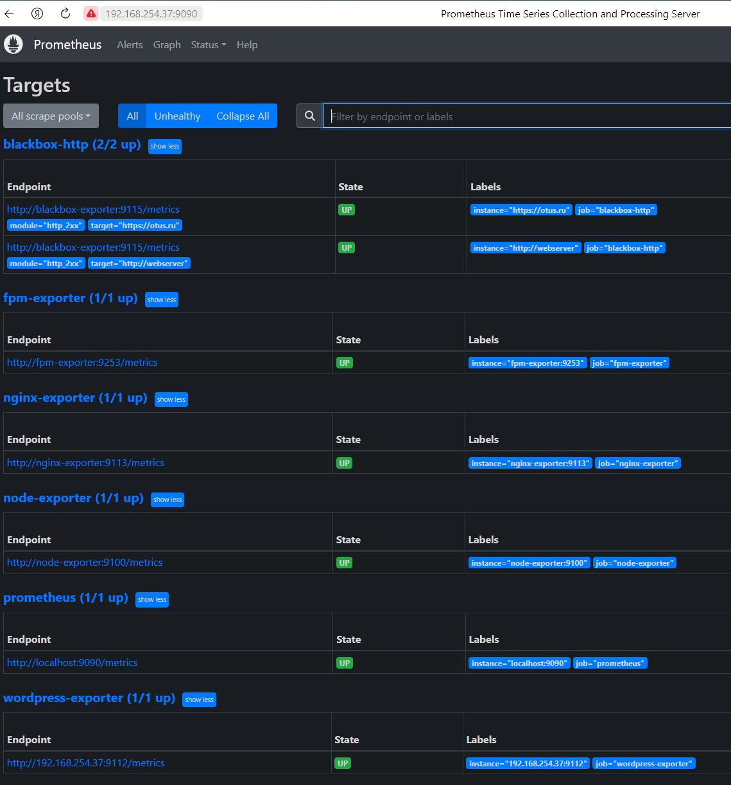

# Задание

**Установка и настройка Prometheus, использование exporters, настройка алертов**

**Цель:**
Установить и настроить Prometheus.
Результатом выполнения данного дз будет являться публичный репозиторий в системе контроля версий (Github, Gitlab, etc.) в котором будет находится Readme с описание выполненых действий. Файлы конфигурации prometheus и alertmanager должны находится в директории GAP-1.

** Описание / Пошаговая инструкция выполнения домашнего задания:**
1. На виртуальной машине или с помощью docker контейнеров (на ваш выбор) установите любую open source CMS которая включает в себя следующие компоненты: nginx, php-fpm, database (MySQL or Postgresql)
2. На этой же виртуальной машине или с помощью docker контейнеров (на ваш выбор) установите Prometheus exporters для сбора метрик со всех компонентов системы (начиная с VM или контейнера и заканчивая DB, не забудьте про blackbox exporter который будет проверять доступность вашей CMS)
3. На этой же или дополнительной виртуальной машине или с помощью docker контейнеров (на ваш выбор) установите Prometheus задачей которого будет раз в 5 секунд собирать метрики с экспортеров
   
4*. Задание со звездочкой 1 (повышенная сложность) - на VM(или докер контейнере) с установленной CMS слишком много “портов экспортеров торчит наружу” и они доступны всем, попробуй настроить доступ только по одному и добавить авторизацию

5*. Если вы выполнили задание со звездочкой номер 1 то - добавить SSL =)

В качестве результата дз принимаются - файл конфигурации Prometheus

Нужно создать свой github репозиторий и залить туда все свои наработки

**Критерии оценки:**
- 0 баллов - задание не выполнено
- 1 балл - задание выполнено успешно

**Рекомендуем сдать до: 16.07.2023**

# Решение
1. Установил Virtualbox + Ubuntu Server 22.04
2. Установил Docker, docker-compose, git, zsh и др. для удобства работы. 
3. Установил Wordpress, используя [официальный image](https://hub.docker.com/_/wordpress), загруженный с Docker Hub
4. Настроил пробросы портов на виртуальную машину для получения сертификата Let's Encrypt на nginx в Wordpress
5. Запустил [certbot в docker](https://hub.docker.com/r/certbot/certbot) для получения сертификата для домена [lab.cherepnin.ru](http://lab.cherepnin.ru) Должно пригодиться для решения задачи со звездочкой.
6. Долго-долго гуглил, ставил экспортеры, правил конфиги, правил свои ошибки...
7. Все собралось, запустилось. Сделал скриншот

PS: задание со звездочкой начал делать, но не успел. Мысль была такая: заблокировать все порты фаерволом, а далее с промощью Nginx добавить location для Prometheus-а.

Результирующий набор открытых портов:
- localhost: 80 # Nginx
- localhost: 443 # Nginx
- localhost: 3306 # MySQL
- localhost: 9000 # Wordpress container
- localhost: 9090 # Prometheus
- localhost: 9100 # Linux OS exporter
- localhost: 9112 # Wordpress exporter
- localhost: 9113 # Nginx exporter
- localhost: 9115 # Blackbox exporter
