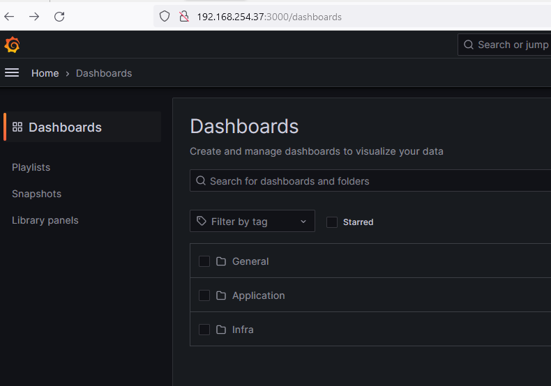
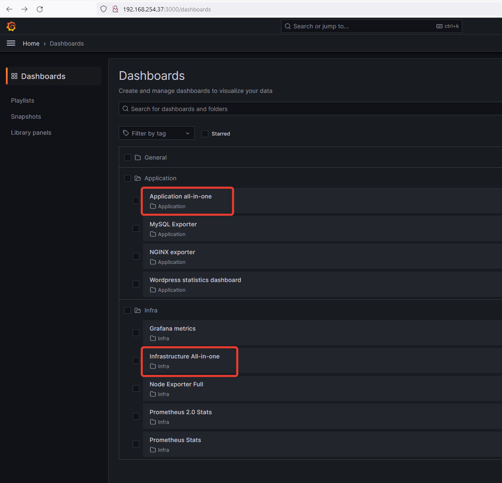
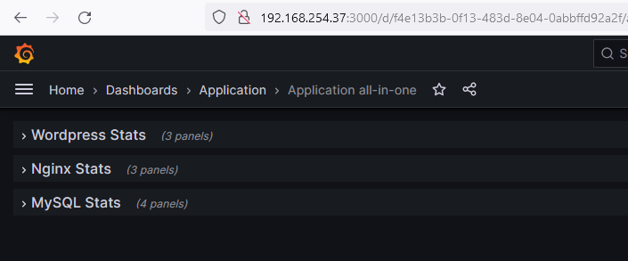
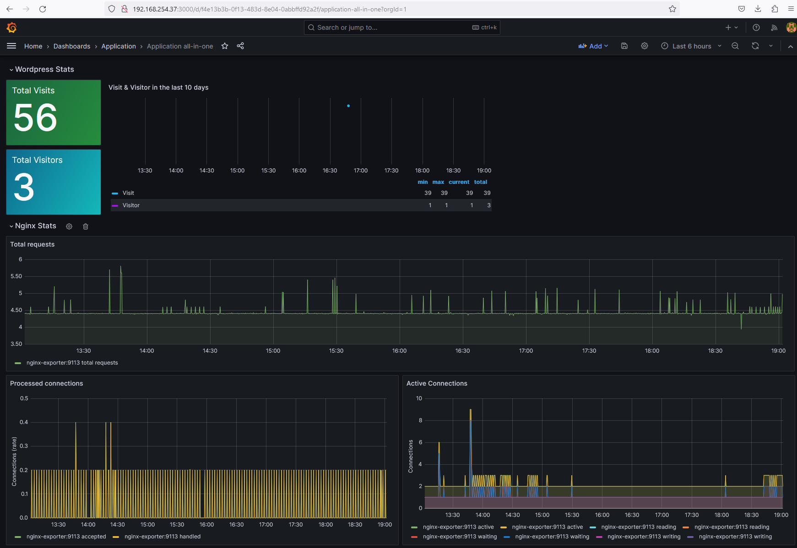
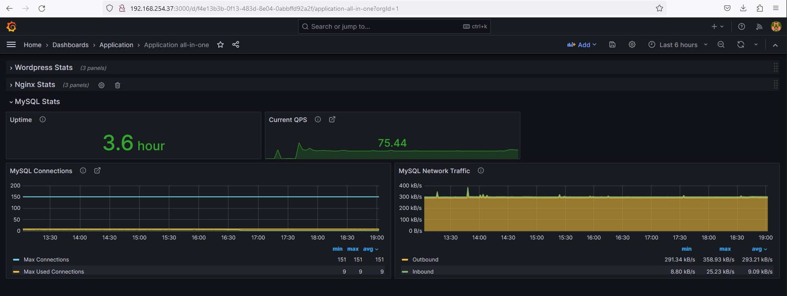
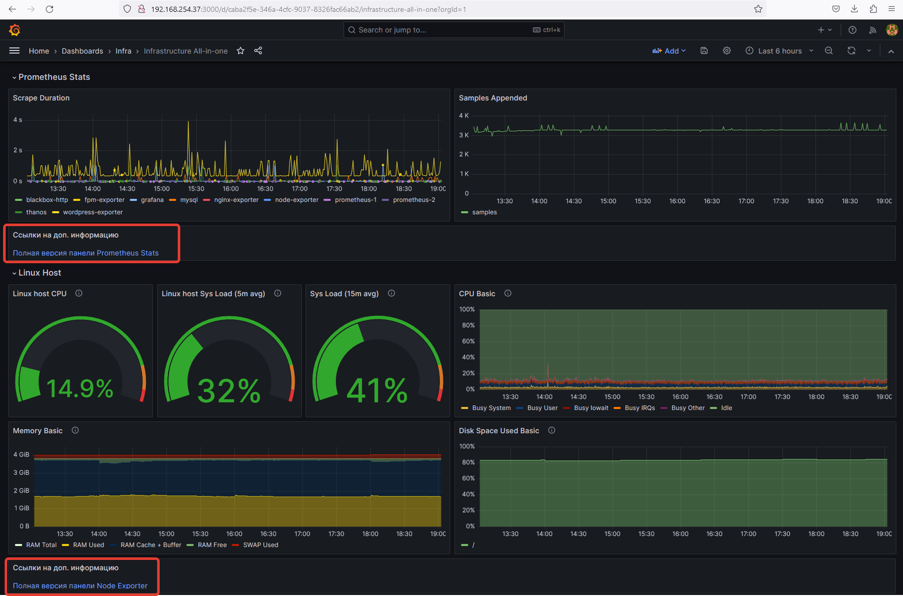
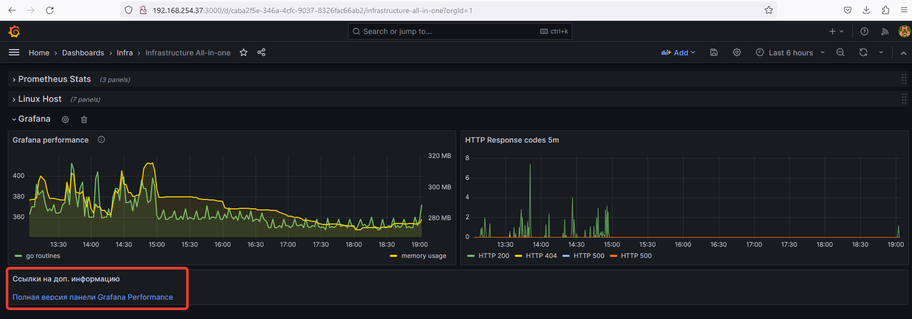
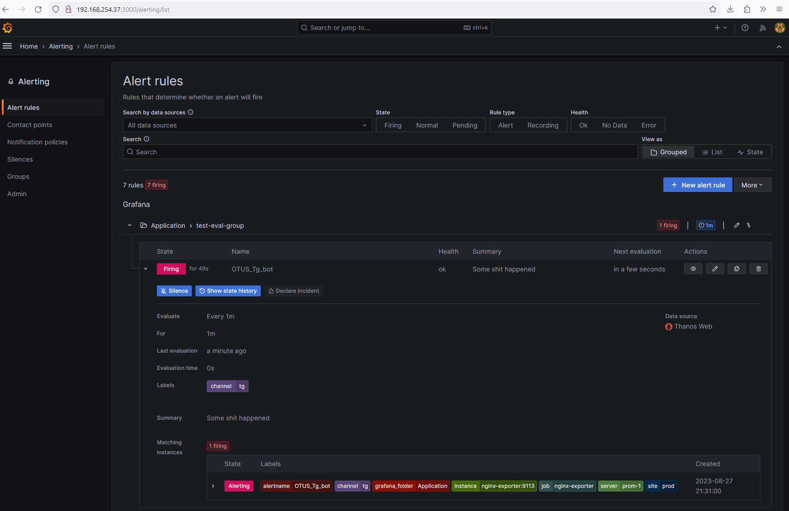

# Формирование dashboard на основе собранных данных из Grafana

**Цель**:
Сформировать dashboard на основе собранных данных с Grafana

**Описание/Пошаговая инструкция выполнения домашнего задания**:

Для выполнения данного дз воспользуйтесь наработками из предыдущего домашнего задания.

На VM с установленным Prometheus установите Grafana последней версии доступной на момент выполнения дз

Создайте внутри Grafana папки с названиями infra и app

Внутри директории infra создайте дашборд который будет отображать сводную информацию по инфраструктуре (CPU, RAM, Network, etc.)

Внутри директории app создайте дашборд который будет отображать сводную информацию о CMS (доступность компонентов, время ответа, etc.)

Задание со звездочкой 1 - при помощи Grafana создайте alert о недоступности одного из компонентов CMS и инфраструктуры
Задание со звездочкой 2 - создайте DrillDown dashboard который будет отображать сводную информацию по инфраструктуре, но нажав на конкретный инстанс можно получить полную информацию

**Результат**: 
- переиспользуйте репозиторий созданный для сдачи предыдущего ДЗ. 
- Дополните Readme описание действий выполненных в результате выполнения данного дз. 
- В директорию GAP-2 приложите скриншоты дашбордов которые вы создали.

**Критерии оценки**:
0 баллов - задание не выполнено
1 балл - задание выполнено успешно

Рекомендуем сдать до: 13.08.2023

# Решение

## Подготовка

В ходе решения было выполнено:
1. Изучены материалы по дашбордам, панелям, переменным, импорту панелей, алертам, каналам оповещений.
2. Импортированы дашборды из общедоступных коллекций
3. Созданы собственные дашборды в соответствии с заданием, размещены в разных папках.
4. Из собственных дашбордов созданы ссылки на более подробные дашборды (импортированные)
5. Настроена отправка уведомлений об авариях в телеграм бота. Для это созданы:
   a. Политика уведомлений (notification policy) 
   b. Правила уведомлений (alert rules)
   c. Способы контакта (contact points)

## Результат 

1. Созданы директории для будущих дашбордов

2. Добавлены новые дашборды и импортированы общедоступные

3. В папке Application созданы панели для наблюдения за приложением

4. В папке Infra созданы панели для наблюдения за инфраструктурой

5. Пример настроенное алерта и полученное сообщение в телеграмм.

