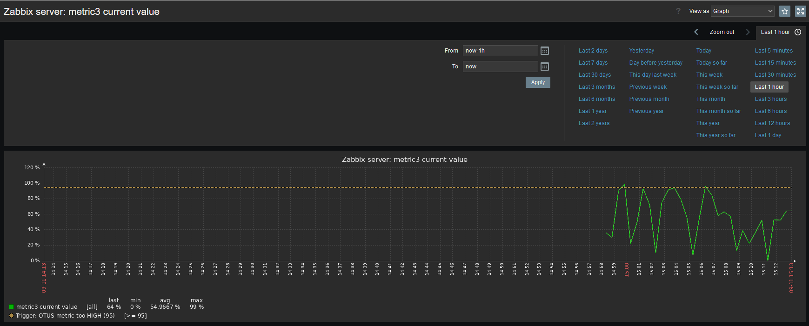

Домашняя работа Zabbix/Alerting

## Задание

Необходимо сформировать скрипт генерирующий метрики формата:
- otus_important_metrics[metric1]
- otus_important_metrics[metric2]
- otus_important_metrics[metric3]
  
С рандомным значение от 0 до 100

Создать правила LLD для обнаружения этих метрик и автоматического добавления триггеров. Триггер должен срабатывать тогда когда значение больше или равно 95.

Реализовать автоматическую отправку уведомлений в телеграмм канал.

В качестве результаты выполнения дз Вы должны предоставить скрипт генерации метрик, скриншоты графиков полученных метрик, ссылку на телеграмм канал с уже отпраленными уведомлениями.

## Решение

Послеовательность действий была такая:
1. Создать скрипт
2. Создать шаблон
3. В шаблоне создать элемент (item), который станет основным (родительским) для прототипов
4. Создать подчиненный прототип элементы (item prototype)
5. Создать подчиненный триггер, связанный с прототипом элемента из п. 4
6. Настроить пользователя для получения алертов. Бот и чат уже есть из прошлых ДЗ.
7. Убедиться, что все работает, наделать скриншотов и оформить страчку на GitHub.

## Скриншоты подтверждения

### Скрипт

`from random import randrange
import json
def get_numbers():
    metric1 = randrange(0,101)
    metric2 = randrange(0,101)
    metric3 = randrange(0,101)

    json_result = [
        {"metric_name":"metric1", "metric_value":metric1 },
        {"metric_name":"metric2", "metric_value":metric2 },
        {"metric_name":"metric3", "metric_value":metric3 }
    ]
    return json.dumps(json_result)
if __name__ == "__main__":
    print(get_numbers())`

### Шаблон

### Основной элемент шаблона

### Макрос шаблона

### Правило обнаружения (discovery)

### Предобработка элемента данных 

### Макрос LLD

### Прототип элемента данных

### Прототип триггера

### График для metric1

### График для metric2

### График для metric3

### Оповещения в телеграмм

