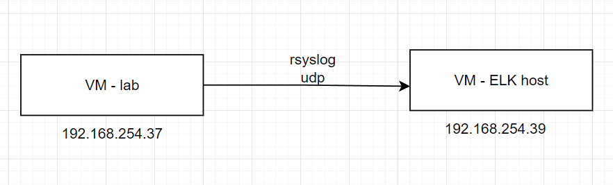
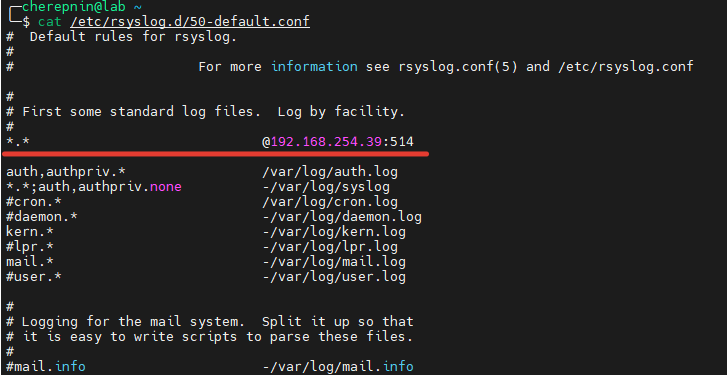
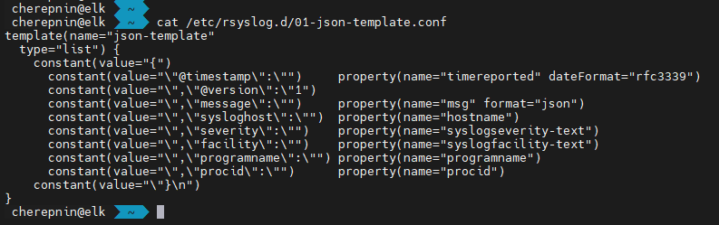
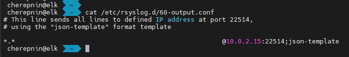
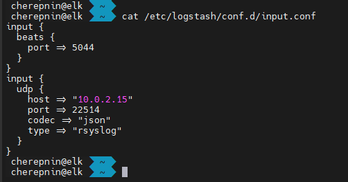
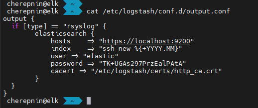
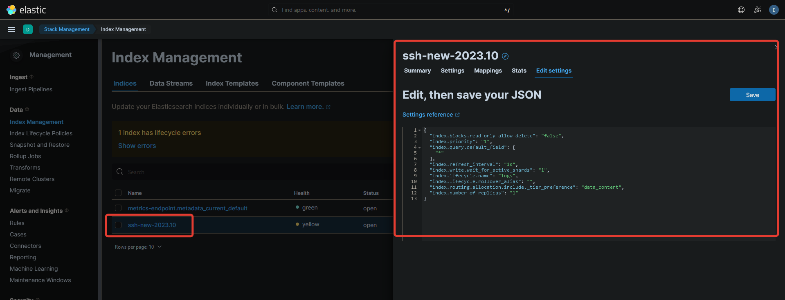
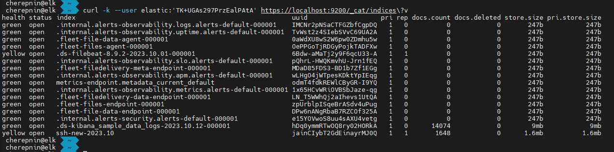
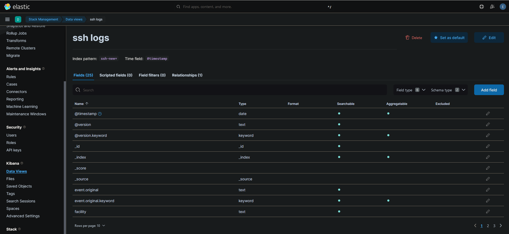
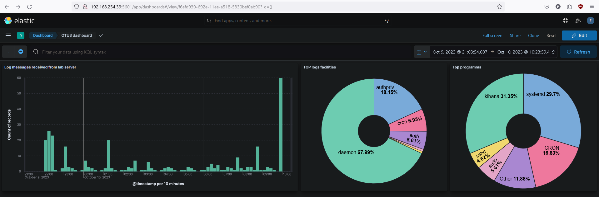

# ДЗ: Установка ELK

## Задание
### Цель: Установить ELK

**Описание/Пошаговая инструкция выполнения домашнего задания**:

Для успешного выполнения ДЗ вам необходимо установить ELK (elasticsearch, logstash, kibana).

Базовая операционная система - по вашему выбору.

После успешной установки ELK-стека вам необходимо настроить отправку логов sshd в elasticsearch через logstash.

Для этого вам придется изменить настройку rsyslog.

Проверьте создался ли index в elasticsearch.

После настройки отправки логов в ELK попробуйте настроить визуализацию логов от sshd в kibana.

В качестве результата ДЗ принимается: конфиг rsyslog, конфиг logstash и результат проверки index в elasticsearch, а также скриншот из kibana, если получилось настроить визуализацию.

## Процесс выполнения работы

Текстовые конфиги в директории configs. Скриншоты ниже по тексту.

0. Подготовка: создал новую VM
   
1. Установил Elastic из deb-пакета. Произвел "тюнинг" по презентации из урока. 
2. Установил Logstash. Настроил input и output правила.
3. Установил Kibana.
4. Поправил hostname-ы, порты, логины и пароли, чтобы увязать elastic и kibana.
5. На соседней VM (из прошлых ДЗ) изменил настройки rsyslog для отправки всех сообщение по UDP на новую VM с установленным ELK

   5.1. rsyslog на сервере лабы
   
   
   
  5.2. шаблон форматирования JSON для rsyslog на сервере ELK
  
   
   
  5.3. Отправка данных в logstash
  
     
    
6. Настройки logstash

  

  

7. В разделе Management -> Index Management проверил новый индекс

    
   
   7.1. Проверка index в консоли
   
     
   
8. В разделе Kiabana добавил новый Data view.

    
   
10. В разделе Analytics -> Dashboard создал новую "витрину данных", в которую добавил несколько графиков по произвольным полям из полученных логов. 

    

**При выполнении ДЗ пользовался материалами статей:**

1. https://serveradmin.ru/ustanovka-i-nastroyka-elasticsearch-logstash-kibana-elk-stack/#Nastrojka_Kibana

2. https://www.digitalocean.com/community/tutorials/how-to-centralize-logs-with-rsyslog-logstash-and-elasticsearch-on-ubuntu-14-04
