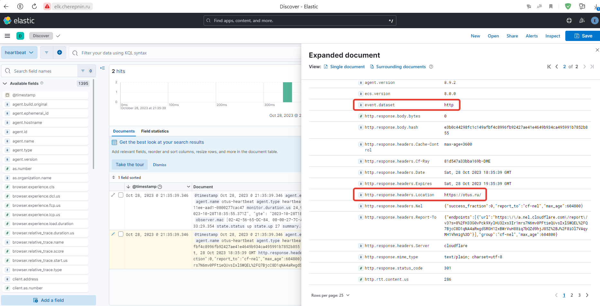
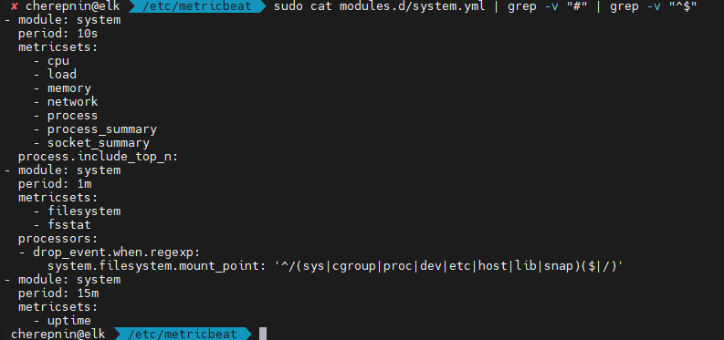
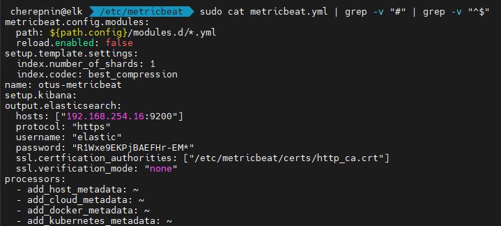

# ДЗ №7

## Цель: Установить beats

## Описание/Пошаговая инструкция выполнения домашнего задания:

Для успешного выполнения дз вам нужно сконфигурировать hearthbeat, filebeat и metricbeat.

Heartbeat должен проверять доступность следующих ресурсов: otus.ru, google.com.

Metricbeat должен формировать метрики на основе показателей загрузки процессора и оперативной памяти.

Filebeat должен собирать логи ssh сервера. По собственному усмотрению вы можете собирать логи других сервисов которые присутствуют в системе ^_^

В качестве результата приложите конфиги hearthbeat, filebeat и metricbeat. Скриншот полученных данных отображенных в Kibana.

# Выполнение

1. Установил deb-пакеты, настроил по мануалам с официального сайта. 

Файлы конфигов:
- [heartbeat.yml](hw_7/heartbeat.yml)
- [metricbeat.yml](hw_7/metricbeat.yml)
- [filebeat.yml](hw_7/filebeat.yml)

  ## Скриншоты

**Filebeat**

**Модули Filebeat**

**Filebeat SSH**

**Heartbeat**

**Heartbeat Kibana HTTP**

**Heartbeat Kibana ICMP**

**Metricbeat**

**Metricbeat Modules**

**Metricbeat yml**

