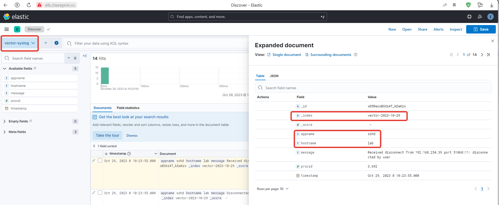

# ДЗ: Замена Filebeat на Vector

## Описание/Пошаговая инструкция выполнения домашнего задания:

Замените Filebeat на Vector. Убедитесь что логи продолжают доставлять в Elasticsearch.

В качестве результата дз принимаются - файл конфигурации Vector

# Выполнение

1. Установил vector из deb-пакета.
2. Отредактировал конфиг vector.yaml на отправку данных в elasticsearch
3. Создал в elasticsearch новый view для kibana

   Конфиг [vector.yaml](hw_8/vector.yaml)

## Скриншоты

**Схема лабы**

**Конфиг vector**

**Index в интерфейсе Elasticsearch**

**Полученные данные в интерфейсе Kiabana**

