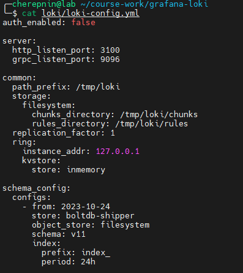
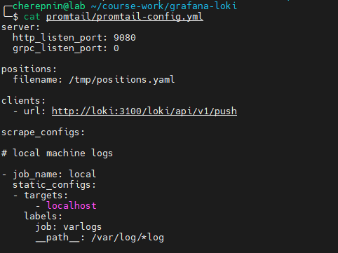
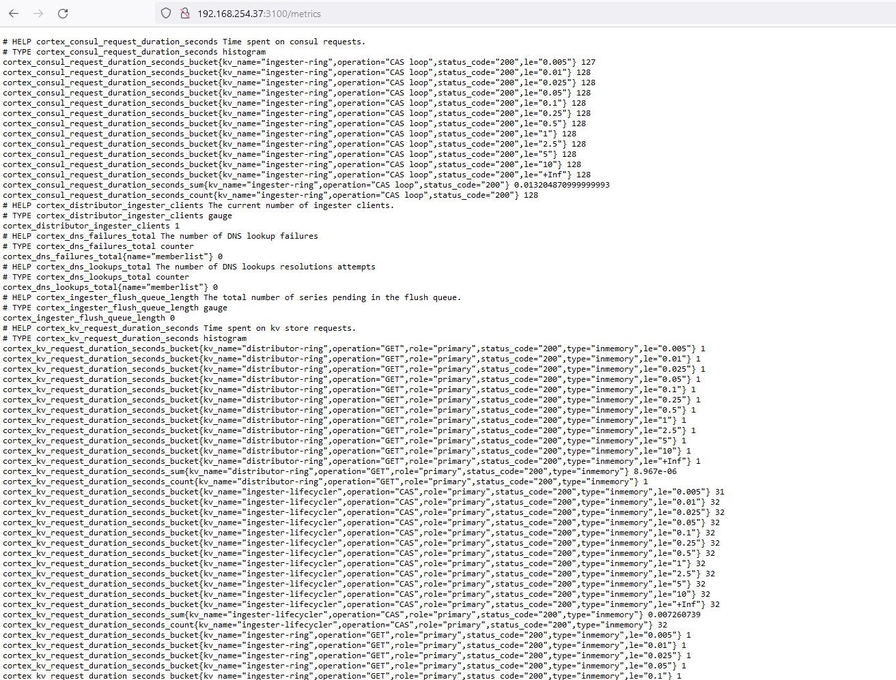
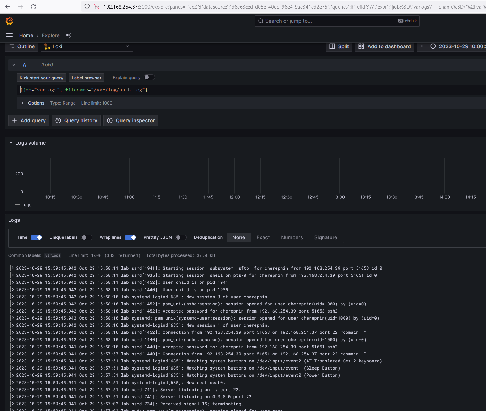

# ДЗ: Конфигурации Grafana Loki

## Описание/Пошаговая инструкция выполнения домашнего задания:

В данном дз вы можете воспользоваться наработками из предыдущего.

В данном дз вам предстоит заменить Elasticsearch на Grafana Loki. Убедитесь что данные поступают в Grafana Loki и к ним есть доступ.

В качестве результата дз принимаются - файл конфигурации Grafana Loki, файл конфигурации шиппера логов (любой шиппер на ваш выбор), скриншот в котором видно что вы получили доступ к логам в Grafana Loki

## Выполнение

1. Запустил в docker контейнеры для Grafana, Loki, promtail
2. Настроил по мануалам конфиги для всех компонентов
3. Добавил Loki в источники данных для Grafana

### Файлы конфигураций:
 - [loki-config.yml](hw_9/loki-config.yml)
 - [promtail-config.yml](hw_9/promtail-config.yml)

### Скриншоты

**Конфиг Loki**

**Конфиг promtail**

**Метрики Loki**

**Логи в Grafana**

